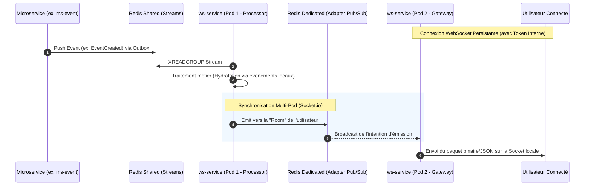

# Architecture & Design Document

## Architecture Overview

Contrairement à un Gateway HTTP classique, le `ws-service` possède une double identité : il est **Serveur (WebSocket Gateway)** pour les clients front-end, et **Consommateur (Post-Processor)** pour le bus d'événements du backend.
Il s'appuie sur des concepts avancés comme le pattern **Scatter-Gather** asynchrone et possède son propre circuit **Outbox** pour garantir l'acheminement des événements sans utiliser d'appels réseau bloquants (gRPC/HTTP).

## Directory Structure

```text
ws-service/
├── src/
│   ├── config/          # Configurations multi-Redis et DB
│   ├── gateways/        # Les contrôleurs WebSocket (@WebSocketGateway)
│   ├── adapters/        # Configuration du RedisIoAdapter dédié au PubSub
│   └── post-processors/ # Runners asynchrones écoutant les streams des autres MS
│       ├── base-gather.post-processor.ts  # Logique abstraite de Scatter-Gather
│       ├── events/      # Écoute des événements du domaine "Event"
│       ├── posts/       # Écoute des événements du domaine "Post"
│       └── users/       # Écoute des événements du domaine "User"
```

## Data Flow : Flux de Notification Temps Réel

Le diagramme suivant démontre comment une action initiée par un microservice aboutit à une notification WebSocket, en prenant en compte la scalabilité multi-pods (où le pod consommant l'événement n'est pas forcément celui hébergeant l'utilisateur final).



## Design Decisions & Trade-offs

### 1. Isolement des clusters Redis (Shared vs Dedicated)
- **Décision** : Maintenir deux clusters Redis distincts en production. L'un pour l'infrastructure asynchrone globale (`bullmq`, `streams`), l'autre uniquement pour le `RedisIoAdapter` de Socket.io.
- **Raison** : Les messages Pub/Sub de Socket.io (pour la synchronisation multi-pod) génèrent un trafic extrêmement dense, éphémère (Fire and Forget) et non-persistant. Le mélanger avec les Redis Streams (qui sont durables et persistés pour les Post-Processors) risquerait de saturer la bande passante réseau, la RAM et les IOPS du Redis central, menaçant la stabilité de toute l'architecture.

### 2. Hydratation par "Scatter-Gather" Asynchrone
- **Décision** : Le fichier `base-gather.post-processor.ts` démontre que le service refuse de faire des appels synchrones gRPC vers d'autres services pour récupérer des données manquantes. Il utilise PostgreSQL pour maintenir l'état du "Gather", et pousse des demandes asynchrones dans sa propre Outbox locale (`jobs_outbox`/`event_outbox`).
- **Compromis** : Ce choix maximalise le découplage et la résilience (le service ne crashera pas si `ms-user` est hors-ligne). Cependant, cela ajoute de la complexité architecturale : la base de données locale doit stocker des états partiels d'événements jusqu'à ce que tous les fragments de données (scatter) soient rassemblés (gather) pour émettre un message complet au client.

### 3. Authentification par Token Interne
- **Décision** : Le `ws-service` fait aveuglément confiance au *Token Interne* fourni lors du handshake initial, qui est préalablement généré par l'API Gateway.
- **Raison** : Évite d'importer le module `@volontariapp/auth` complexe et de faire des appels à la base de données pour valider les tokens OAuth. Si le Token Interne est cryptographiquement valide (via JWT Secret partagé), la connexion est autorisée.
